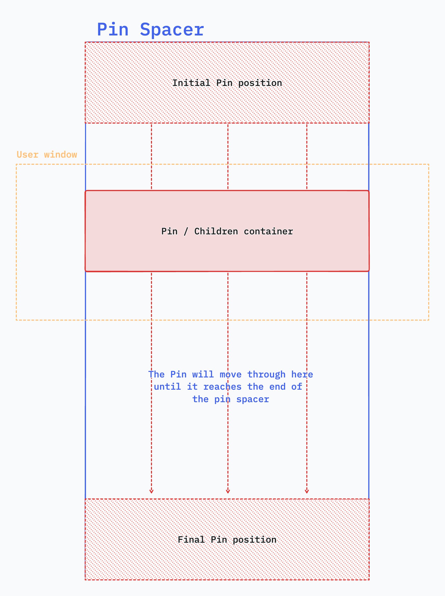

## Core concepts

### How the Pin internally works

What is a `Pin Spacer`?

The Pin Spacer is the container where the Pin itself (with all its children) moves when pinned. It tells the Pin where the boundaries of its movement are.

### What the heck is a tween?

From [gsap docs](https://greensock.com/docs/v3/GSAP/Tween):

> A Tween is what does all the animation work - think of it like a high-performance property setter. 
> You feed in targets (the objects you want to animate), a duration, and any properties you want to animate and when its playhead moves to a new position, it figures out what the property values should be at that point applies them accordingly. [(Read more)](https://greensock.com/docs/v3/GSAP/Tween)

In this library we took this tween definition and use it with a few tweaks[^1] for our `Animation` component and its variants (`Pin`, `Parallax`, etc.)

[^1]: For example we remove the duration and use `start` and `end` props based on the scrolling progress inside the `<Pin />` component to set the correct duration for each animation (_tween_).